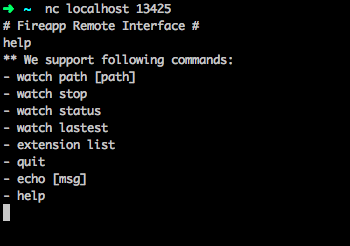
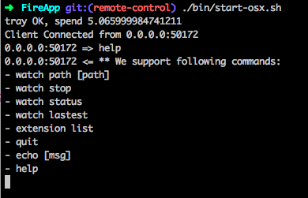

# Fire.app Remote Control (Beta)

Fire.app 在啟動後，會自動 listen 13425 port。

我們可以用 `nc localhost 13425` 來連上控制界面。並且鍵入 help 來查看支援的指令。

而在 Fire.app 那邊則可以看到：

以下簡單說明目前有支援的指令

## Watch Project

- 使用 `watch path [project_path]` 控制 Fire.app watch 此 project。

	*注意： project_path 指的是與 Fire.app 同一臺電腦下的 path，而目前尚無法讓 Fire.app watch 其他電腦上的 prject。 若是 client 與 Fire.app 不使用同一個 host 時請小心。*

- 使用 `watch lastest` 直接 watch 最近一個使用過的 project 。
- 使用 `watch status` 可確認目前是否有 watch project 。若是有的話，一併回傳目前的 project path。

## Stop Watching

- 使用 `watch stop` 終止目前的工作

## Others

- 使用 `extension list` 列出 Fire.app 有支援的 extension 清單
- 使用 `quit` 關閉 Fire.app
- 使用 `echo [msg]` 讓 Fire.app 回傳 msg (測試功能) 。

---

## Motivation

需要有 remote interface 的原因有幾個，其中最主要的想法是希望可以結合 rspec ，方便做 unit test 。另外一點是， Fire.app 也算是一個吃記憶體的 app ，如果許多電腦可以共用某一檯電腦內的 Fire.app 來 compiler 自己的檔案，感覺也不錯。
*註：要達成 unit test 我目前還有另一個想法是使用 applescript 來控制 interface ，有機會可以研究。*

## TODO

1. 讓 remote interface 能回傳一致的資料格式
2. Fire.app 有很多動作必須選擇資料夾/檔案，如 create project / watch project 。之前寫 rspec 有解決這個問題，需要把它整合進來
3. 需要有 nc 的 ruby implement version ，除了不是所有作業系統都有 nc 指令這個原因之外，我們也需要讓 rspec 可以控制 nc 
4. 像是 Preference / Change Option 等功能，會開啟一個新視窗。新開的那個視窗的控制方法必須要研究一下。

*本功能的主要模組在 src/tcpsocket-server.rb*

